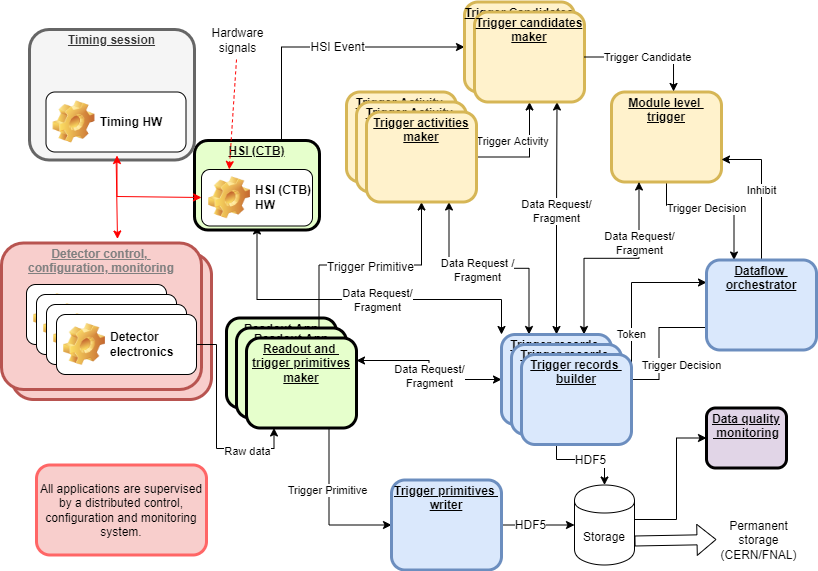

# Conceptual Overview

The goal is to develop an online AI/ML inference framework that runs in [DUNE DAQ](https://dune-daq-sw.readthedocs.io/en/latest/). The current plan is to test this in Iceberg, the DUNE cold electronics test stand located at Fermilab's Proton Assembly Building (PAB), though we may considering running this in ProtoDUNE in the future. To do this, we're using [NVIDIA's Triton framework](https://docs.nvidia.com/deeplearning/triton-inference-server/user-guide/docs/index.html), which is wrapped by the [SONIC framework](https://yongbinfeng.gitbook.io/sonictutorial/introduction) to make our lives easier. (Note that SONIC is a framework that can use more than just Triton, so it's not "just a wrapper", but it essentially functions like one in our case.) SONIC employs a client-server model, where in our case DUNE DAQ is the client which sends inference requests to a Triton server containing pre-loaded model configurations. You can run your own server using [NVIDIA's docker containers](https://yongbinfeng.gitbook.io/sonictutorial/prerequisites), but I recommend using the Triton server on `ailab01.fnal.gov`. 

Triton is not included in DUNE DAQ, and since the scope of this project is relatively narrow, there are no plans to add it. To use Triton in DUNE DAQ, you need to install it yourself in a local DUNE DAQ development area. DUNE DAQ is a project containing mostly C++ and Python packages managed using the [Spack package manager](https://spack.io/). As of this writing, the Triton inference calls are treated as a trigger algorithm which packages streamed Trigger Primitives to be sent to the server for inference. A [Trigger Primitive (TP)](https://dune-daq.github.io/docs/trgdataformats_2include_2trgdataformats_2TriggerPrimitive_8hpp_source.html) is a DUNE DAQ data structure that represents an interesting bit of raw data, including ADC samples above threshold, start time, etc. TPs are formed from raw data coming off detector electronics (left middle box in the diagram below), and can be thought of as a "first step" in DUNE DAQ. They are subsequently aggregated into Trigger Activities (left yellow box; literally just a `std::vector` of TPs), then Trigger Candidates (middle yellow box), and eventually written to HDF5 files as Trigger Records (middle blue box). For now, we're mostly concerned with TPs, since those are as close as we can reasonably get to using streamed raw data without overwhelming our servers.

